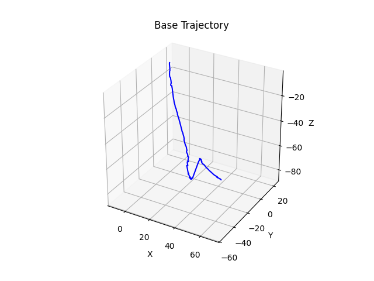
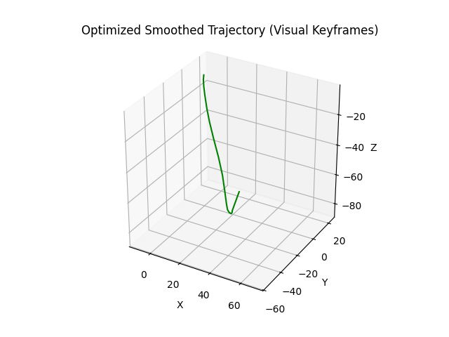
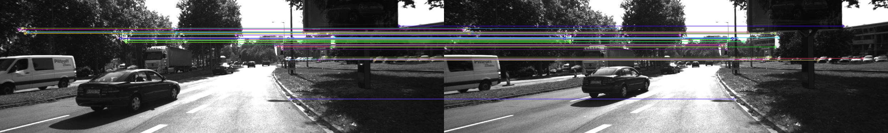

# AV-SLAM System: Monocular Trajectory Estimation with Keyframe-Based Smoothing


## 🔍 Overview

This project implements an AV-SLAM (Autonomous Vehicle SLAM) system using monocular image sequences. It extracts 6-DoF poses, selects keyframes based on ORB feature matching, and generates a smoothed trajectory using Savitzky-Golay filtering.

- 📌 **Dataset Used**: `KITTI 2001_09_26_drive_0051_sync`
- 🔧 **Pipeline Stages**:
  1. Pose extraction from monocular inputs
  2. Keyframe selection via ORB feature matching
  3. Trajectory building via matrix composition
  4. Trajectory optimization using filtering

---

## 📁 Folder Structure

```
AV-SLAM-SYSTEM/
├── data/
│   └── 2001_09_26_drive_0051_sync/
│       ├── grayscale/
│       └── pose/poses.txt
├── include/
│   ├── keyframe_selector.py
│   ├── face_detection.py
│   ├── image_downloader.py
│   ├── search_utils.py
│   ├── transcript_agent.py
│   ├── video_audio.py
│   ├── model_summarizer.py
│   ├── browser_collector.py
│   └── matcher.py
├── output/
│   ├── trajectory/
│   │   ├── base_trajectory.txt
│   │   ├── base_trajectory.png
│   │   ├── smoothed_trajectory.txt
│   │   └── optimized_trajectory.png
│   └── matcher/
│       └── match_0232_0234.png
├── System Design.png
├── src
|   ├──run_pipeline.py
├── main.py
├── README.md
```

---

## ⚙️ Requirements

- Python 3.7+
- `opencv-python`
- `numpy`
- `matplotlib`
- `scipy`

Install via pip:

```bash
pip install -r requirements.txt
```

---

## 🚀 How to Run

1. **Download KITTI sequence** `2001_09_26_drive_0051_sync` and place it under:
   ```
   data/2001_09_26_drive_0051_sync/
   ```

2. **Run the trajectory pipeline**:

```bash
python main.py 
```

3. **Output** will be saved in:
```
output/trajectory/
```

---

## 📊 Outputs

### Base Trajectory (Raw)


This trajectory is constructed by composing raw pose matrices. It may contain jitter due to monocular limitations.

---

### Optimized Trajectory (Keyframe-Based)


After selecting keyframes using ORB matching and applying Savitzky-Golay smoothing, this trajectory shows cleaner and smoother motion.

---

## 🔎 Keyframe Selection Example

Feature matching is visualized below using ORB between Frame 232 and 234.



Frames with fewer than 40 matches are skipped to reduce redundancy.

---

## 📌 Reference

- ORB-SLAM2: Mur-Artal & Tardos, IEEE TRO 2017
- KITTI Dataset: Geiger et al., IJRR 2013
- OpenCV ORB: https://docs.opencv.org/

---

## 👨‍💼 Authors

- Harshil Sharma
- Harsh Patel
- Dhyey Patel

GitHub Repo: [AV-SLAM System](https://github.com/xxender13/AV-SLAM-SYSTEM.git)
